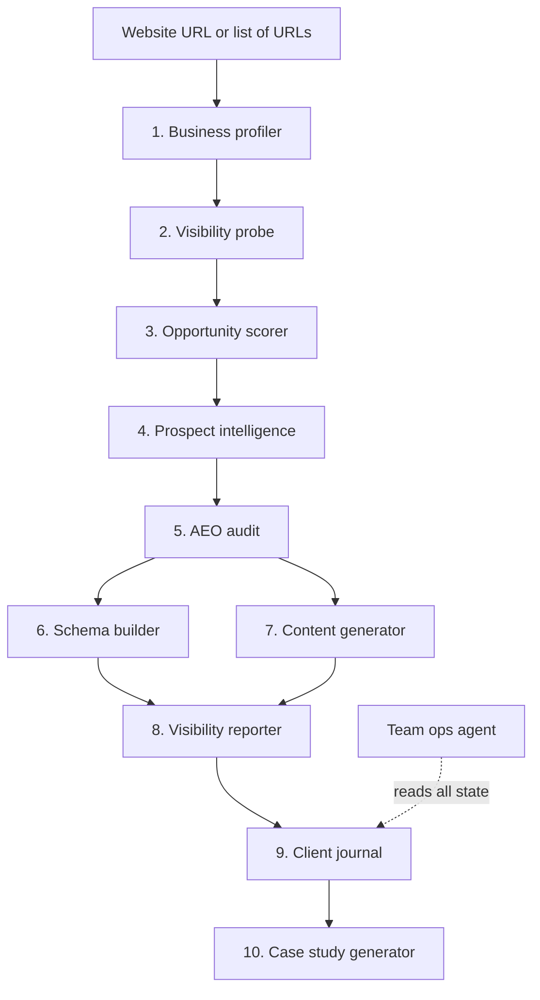

# AEOStudioAgents — Plan

**Version 1 · 7 September 2026**

Read this file before doing anything in this repository. It defines what we are building, why each agent exists, how they connect, and the rules that govern the code. When a decision is not covered here, ask rather than assume.

---

## 1. What this is

AEO Studio helps businesses get named by AI assistants — ChatGPT, Perplexity, Gemini, Google AI Overviews, Claude — when a customer asks a question that business should be the answer to.

This repository is the agent platform that does the repeatable work: understanding a business, measuring how visible it is to AI, finding what needs fixing, producing the fixes, and proving the results over time.

**It must work for any business with a website.** A dentist, a real estate agent, a startup, an event company, a retail store, a digital agency. Nothing may be hardcoded to one industry, one city, or one language. Canada first, English and French, designed to work anywhere.

**People stay in charge.** Agents draft, measure, and record. They never send, publish, or deploy anything.

---

## 2. The five goals

Every agent serves one of these. If a proposed agent serves none of them, do not build it.

1. Do the prerequisites before AEO work starts — understand the business, measure where it stands, record a baseline.
2. Support the actual AEO/GEO work — structured data and content that make a business understandable and citable to AI.
3. Document every step and every result for each client, so the whole journey can be reconstructed.
4. Turn results into case studies for future business.
5. Find other businesses where AEO would make a big difference.

Explicitly out of scope: pricing, proposals, invoicing, customer-value estimation, email sending, CRM sync. Outreach drafting is parked for a later phase.

---

## 3. The core idea: the Business Profile

The system does not know in advance what kind of business it is looking at, so it works it out from the website. The **Business Profile** is the first thing produced for any business and the object every other agent reads.

A profile answers:

- What does this business sell or do?
- Who buys it?
- Where does it operate, and in what language(s)?
- What type is it? One of five: `local_service`, `professional_practice`, `b2b`, `ecommerce`, `agency_startup`.
- What questions would a buyer ask an AI assistant before choosing them?
- What is it called, including alternate names and brands?
- Who are its apparent competitors?

The probe generates its queries from the profile. The scorer weighs signals using it. The schema builder picks markup by its business type. The content generator writes from its buyer questions.

**If the profile is wrong, everything downstream is wrong.** Build it first, test it on very different businesses, trust nothing else until it holds.

---

## 4. Architecture map

Four phases:

- **Find and measure** — profiler, probe, scorer. Run in batch over a list of URLs, this is also how we find new prospects (goal 5).
- **Prove and deliver** — prospect intelligence, audit, schema builder, content generator.
- **Document** — visibility reporter, client journal.
- **Grow** — case study generator.
- **Always on** — team ops agent, built last.

---

## 5. The agents

### 1. business-profiler

**Purpose.** Turn a website into a structured Business Profile.
**Lifecycle position.** First. Everything depends on it.
**Input.** A website URL.
**Output.** `BusinessProfile` — type, offering, buyer description, location, languages, buyer questions (5–8), alternate names, apparent competitors, confidence, evidence.
**Reader.** Every other agent. Never shown to a client.
**Model.** Sonnet — needs judgment, runs on hundreds of businesses.
**Notes.** Must handle thin sites, French sites, and businesses doing several things at once. When it cannot classify confidently, it says so and the business goes to the human queue rather than downstream.

### 2. ai-visibility-probe

**Purpose.** Measure what AI engines actually say when a buyer asks about this kind of business.
**Lifecycle position.** Second. Called again later by the reporter and read by the audit.
**Input.** A `BusinessProfile`. Live AI engine APIs.
**Output.** Raw rows — every query, engine, full answer text, and every business named — stored permanently. A visibility score computed from those raws by a versioned formula.
**Reader.** Scorer, prospect intelligence, audit, reporter. The score reaches clients; raw results never do.
**Model.** Sonnet to write buyer queries (once per business). Haiku to extract named businesses from answers (the highest-volume call in the system).
**Modes.** `lite` (3–4 queries, 2 engines), `full` (5–8 queries, 4+ engines), `delta` (re-run a stored query set and compare).
**Notes.** AI answers vary between runs. Support N repeated runs and report the median. Before anything is built on top of this, run the same business three times in one day and measure the spread — that number decides how scores are reported.

### 3. opportunity-scorer

**Purpose.** Answer one question — how much would AEO help this business?
**Lifecycle position.** Third. In batch mode over many URLs, this is the prospecting engine (goal 5).
**Input.** Profile, probe results, business signals from Google Places.
**Output.** A ranked opportunity score with per-signal reasons.
**Reader.** Us. Decides who gets a dossier.
**Model.** Haiku extracts signals. The score itself is plain Python — deterministic and explainable.
**Signals.** Gap size (invisible while a named competitor is cited), technical fixability (CMS, editable site), business reality (reviews, locations, activity).

### 4. prospect-intelligence

**Purpose.** The private dossier — everything we know, plus what we would fix first.
**Lifecycle position.** First step of engagement. Written before anything client-facing exists.
**Input.** Profile, probe results, opportunity score.
**Output.** An internal document: business summary, competitor landscape, engine-by-engine findings, weaknesses, a first-pass fix plan, and ready-to-use statements grounded in the data (e.g. "X appears in 4 of 5 questions a buyer asks; you appear in 0").
**Reader.** Us only. Never sent to the business.
**Model.** Opus — this is the thinking document.

### 5. aeo-audit

**Purpose.** The client-facing baseline. Proves the problem is real and records day-one position.
**Lifecycle position.** The prerequisite deliverable (goal 1). Re-run later as a re-audit for comparison.
**Input.** The dossier.
**Output.** A branded PDF: visibility score and tier, the queries asked, who appeared instead, competitors ranked by gap, engine-by-engine breakdown.
**Reader.** The client.
**Model.** Opus.
**Rules.** Never states anything the dossier has not established. Never contains our full fix plan. Re-audit mode records what changed without claiming sole causation.

### 6. schema-builder

**Purpose.** Make the site machine-readable so AI engines can understand what the business is.
**Lifecycle position.** Delivery (goal 2).
**Input.** Site HTML, business type from the profile.
**Output.** Validated JSON-LD blocks, an `llms.txt` file, and a diff against existing markup.
**Reader.** A person deploys it. The agent never writes to a live site.
**Model.** Sonnet — rule-following work, checked by a validator.
**Notes.** Step 0 is always to read and assess existing JSON-LD before generating anything, to avoid duplicate or conflicting markup. Business type drives which schema.org types apply.

### 7. aeo-content-generator

**Purpose.** Write pages built to be quoted by AI assistants.
**Lifecycle position.** Delivery (goal 2).
**Input.** Buyer questions from the profile, currently-cited pages from the probe.
**Output.** Draft pages — direct answer first, evidence, third-person phrasing, FAQ blocks.
**Reader.** A person edits every page before publication. No exceptions.
**Model.** Opus — published under the client's name.
**Notes.** Before writing, fetch and analyse the page currently cited for that query and identify what makes it citable.

### 8. weekly-visibility-reporter

**Purpose.** Re-measure against baseline and record movement. This is the impact record (goal 3).
**Lifecycle position.** Ongoing, weekly, per active client.
**Input.** Stored baseline query set; a fresh `delta` probe run.
**Output.** This week's scores, change vs baseline and vs last week, draft commentary.
**Reader.** The client (report), the journal (numbers).
**Model.** Haiku for extraction, Sonnet for commentary.
**Rule.** Flat or declining weeks route the commentary to the human queue — a person writes the interpretation.

### 9. client-journal

**Purpose.** The dated log of everything that happened on a client — every action and every result, in order (goal 3, and the input to goal 4).
**Lifecycle position.** Ongoing, from signature onward.
**Input.** Actions logged by people and agents; numbers from the reporter.
**Output.** A running journey log per client.
**Reader.** Us, team ops, case study generator.
**Model.** Haiku.

### 10. case-study-generator

**Purpose.** Turn a client's journey into a sales asset (goal 4).
**Lifecycle position.** After a client has results worth telling.
**Input.** Client journal, baseline audit, latest reporter numbers.
**Output.** A draft case study marked `consent_pending`.
**Reader.** Us, then the client for consent, then the public.
**Model.** Opus.
**Rule.** Nothing is published or used in prospecting until written client consent is recorded.

### Team ops agent

**Purpose.** Daily internal briefing.
**Lifecycle position.** Cross-cutting. Built last.
**Input.** The state of every table. No external input.
**Output.** One short daily message: pipeline movement, what is waiting on a human.
**Reader.** The team. Never client-facing.
**Model.** Sonnet.

---

## 6. Models

All agents run on Claude via the Anthropic API. Routing is set in one config file and chosen by two questions: does a person read the output with a business's name on it, and how often does it run?

| Tier | Model string | Used by |
|---|---|---|
| Haiku | `claude-haiku-4-5` | Citation extraction in the probe, signal extraction in the scorer, journal entries, reporter extraction |
| Sonnet | `claude-sonnet-4-6` | Profiler, probe query generation, schema builder, reporter commentary, team ops |
| Opus | opus-tier | Prospect intelligence, audit, content generator, case study |

Haiku carries roughly 80% of calls; Opus carries roughly half the spend. Everything non-interactive — batch profiling, batch probing, weekly reports — goes through the Batch API.

---

## 7. External services

**AI engines (the thing we measure).** To know what ChatGPT says, we must ask ChatGPT. Each engine sits behind a common interface so implementations can be swapped without touching callers.

| Engine | Access | Note |
|---|---|---|
| ChatGPT | OpenAI API, web search enabled | Without search enabled it answers from training data, which is not what a user sees |
| Perplexity | Perplexity API (Sonar) | Returns citations natively |
| Gemini | Google Gemini API, grounding enabled | Same caveat as ChatGPT |
| Google AI Overviews | No official API — via DataForSEO or SerpAPI | Most-seen AI answer, hardest to measure |
| Claude | Anthropic API, web search | Already available |
| Grok | xAI API | Optional |

API answers can differ from consumer-app answers (location, personalization). We measure via API and say so in the audit.

**Other services.**

| Purpose | Service |
|---|---|
| Reading websites (incl. JS-heavy) | Firecrawl or Jina Reader |
| Business signals (reviews, locations, hours) | Google Places API |
| Competitor lookup | Brave Search or Serper |
| Schema validation | Local Python libraries; Google Rich Results Test as a manual final check |
| Database | Supabase (Postgres); local Docker Postgres during development |
| PDFs | Jinja2 + WeasyPrint, locally |

**Not needed:** email sending, CRM sync, payments.

---

## 8. Technical rules

These are not negotiable. They exist so the system stays debuggable and defensible.

1. **One harness, ten configs.** Build `core/` once. Each agent is a definition file — system prompt, Pydantic output schema, allowed tools, model choice. Adding an agent must be a same-day edit, not new engineering.
2. **No frameworks.** Anthropic SDK directly. A tool-use loop in `core/llm.py`. No LangChain, no CrewAI, no orchestration engine.
3. **Store raw, compute later.** The probe stores full answers. Scores derive from raws via a versioned formula so history can be recomputed.
4. **Scores are code, not prompts.** Any number a client might challenge comes from a deterministic Python function.
5. **Every LLM call is logged** — agent, model, prompt version, input, output, tokens, cost, latency — before returning to the caller. No call bypasses the wrapper.
6. **Structured output everywhere.** Every agent returns a Pydantic model with `confidence: float` and `evidence: list[str]`. On validation failure: retry once with the error appended, then write to the human queue and fail loudly.
7. **Low confidence never flows downstream.** It goes to the human queue.
8. **Prompts are versioned artifacts** with 3–5 golden examples each and a pytest harness that flags regressions.
9. **One probe engine.** Probe, reporter, and audit all use it with a mode switch. There is exactly one place where "what does AI say" is measured.
10. **Migrations are append-only.** Never edit an applied migration; add a new numbered one.
11. **Language follows the buyer.** Probe in the language the business's customers actually use.
12. **Nothing is scheduled until it has run cleanly by hand ten times.** Agents start as CLI commands.

---

## 9. Human checkpoints

| Always a person | Why |
|---|---|
| Deploying schema to a live site | A broken tag on a client site is a real incident |
| Publishing any content page | Unedited AI content under a client's name loses the client |
| Sending the audit | Their name is on it |
| Commentary in a flat or bad week | Needs judgment, not an auto-generated sentence |
| Using a case study anywhere | Written client consent first |
| Anything an agent flags as low confidence | By design |

---

## 10. Build order

Nothing is built before the thing that feeds it has been tested on real businesses.

0. Scaffold — folders, `pyproject.toml`, Docker Postgres, migrations. No logic.
1. `core/` — llm wrapper with cost logging, db, tools, runner, error handling.
2. **business-profiler** — then test on four very different businesses before proceeding.
3. **ai-visibility-probe** — then run one business three times in one day and measure score variance. That number decides how scores are reported everywhere.
4. **opportunity-scorer** — pure-code scoring plus batch mode. Prospecting now works.
5. **prospect-intelligence**, then **aeo-audit**.
6. **schema-builder**, then **aeo-content-generator** — once there is a real client.
7. **weekly-visibility-reporter**, then **client-journal** — once there is a baseline.
8. **case-study-generator**.
9. **team-ops-agent**.

Build one agent at a time. Stop after each for review. Do not build ahead.

### Definition of done for any agent

- Pydantic output schema with `confidence` and `evidence`
- Versioned prompt file
- At least 3 golden examples and a passing golden test
- Every LLM call visible in the `runs` table with cost and latency
- Low-confidence or failed output lands in the human queue
- A working CLI command that runs it on real input

---

## 11. First test businesses

Deliberately different from each other, so the profiler is proven across types rather than tuned to one:

1. **O'land Stations** — olandstations.com — B2B product/service, events, Montreal, English and French
2. A dental or medical practice — professional practice, local
3. An e-commerce store — online retail
4. A digital or creative agency — agency/startup

If the profiler classifies all four correctly and the probe produces sensible buyer questions for each, the "any business" claim holds. If not, fix the profiler before building anything else.

---

*This is the base plan. Changes to it are deliberate and dated.*
